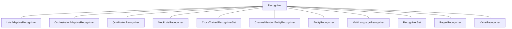

- Classes that have `logPersonalInformation` property:
    - `LuisAdaptiveRecognizer`
    - `QnAmakerRecognizer`

- Classes that override base `Recognizer`'s `FillRecognizerResultTelemetryProperties`:
    - `LuisAdaptiveRecognizer`
