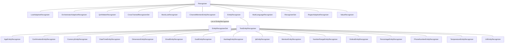

### Class Diagram of Recognizers in the SDK Currently

```mermaid
graph TD
    Recognizer --- LuisAdaptiveRecognizer
    Recognizer --- OrchestratorAdaptiveRecognizer
    Recognizer --- QnAMakerRecognizer
    Recognizer --- CrossTrainedRecognizerSet
    Recognizer --- MockLuisRecognizer

    Recognizer --- ChannelMentionEntityRecognizer
    Recognizer --- EntityRecognizer
        EntityRecognizer -. List of EntityRecognizer .- EntityRecognizerSet
        EntityRecognizer --- TextEntityRecognizer
            TextEntityRecognizer --- AgeEntityRecognizer
            TextEntityRecognizer --- ConfirmationEntityRecognizer
            TextEntityRecognizer --- CurrencyEntityRecognizer
            TextEntityRecognizer --- DateTimeEntityRecognizer
            TextEntityRecognizer --- DimensionEntityRecognizer
            TextEntityRecognizer --- EmailEntityRecognizer
            TextEntityRecognizer --- GuidEntityRecognizer
            TextEntityRecognizer --- HashtagEntityRecognizer
            TextEntityRecognizer --- IpEntityRecognizer
            TextEntityRecognizer --- MentionEntityRecognizer
            TextEntityRecognizer --- NumberRangeEntityRecognizer
            TextEntityRecognizer --- OrdinalEntityRecognizer
            TextEntityRecognizer --- PercentageEntityRecognizer
            TextEntityRecognizer --- PhoneNumberEntityRecognizer
            TextEntityRecognizer --- TemperatureEntityRecognizer
            TextEntityRecognizer --- UrlEntityRecognizer

    Recognizer --- MultiLanguageRecognizer
    Recognizer --- RecognizerSet
    Recognizer --- RegexAdaptiveRecognizer
    Recognizer --- ValueRecognizer
```