```mermaid
graph TD
    Recognizer --- AdaptiveRecognizer

    AdaptiveRecognizer --- LuisAdaptiveRecognizer
    AdaptiveRecognizer --- OrchestratorAdaptiveRecognizer
    AdaptiveRecognizer --- QnAMakerRecognizer
    AdaptiveRecognizer --- CrossTrainedRecognizerSet
    AdaptiveRecognizer --- MockLuisRecognizer

    Recognizer --- ChannelMentionEntityRecognizer
    Recognizer --- EntityRecognizer
        EntityRecognizer -. List of EntityRecognizer .- EntityRecognizerSet
        EntityRecognizer --- TextEntityRecognizer
            TextEntityRecognizer --- AgeEntityRecognizer
            TextEntityRecognizer --- ConfirmationEntityRecognizer
            TextEntityRecognizer --- CurrencyEntityRecognizer
            TextEntityRecognizer --- DateTimeEntityRecognizer
            TextEntityRecognizer --- DimensionEntityRecognizer
            TextEntityRecognizer --- EmailEntityRecognizer
            TextEntityRecognizer --- GuidEntityRecognizer
            TextEntityRecognizer --- HashtagEntityRecognizer
            TextEntityRecognizer --- IpEntityRecognizer
            TextEntityRecognizer --- MentionEntityRecognizer
            TextEntityRecognizer --- NumberRangeEntityRecognizer
            TextEntityRecognizer --- OrdinalEntityRecognizer
            TextEntityRecognizer --- PercentageEntityRecognizer
            TextEntityRecognizer --- PhoneNumberEntityRecognizer
            TextEntityRecognizer --- TemperatureEntityRecognizer
            TextEntityRecognizer --- UrlEntityRecognizer

    AdaptiveRecognizer --- MultiLanguageRecognizer
    AdaptiveRecognizer --- RecognizerSet
    AdaptiveRecognizer --- RegexAdaptiveRecognizer
    AdaptiveRecognizer --- ValueRecognizer
```

TODO actually need ALL of them, including the entity recognizers to derive from AdaptiveRecognizer, because they do get the BotTelemetryClient from Recognizer class and can technically call TrackRecognizerResult as well, without ability to exclude logging pii