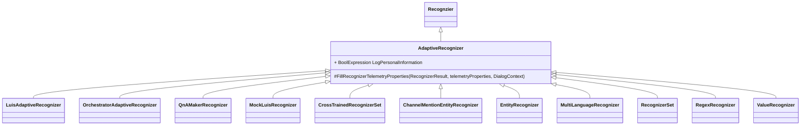
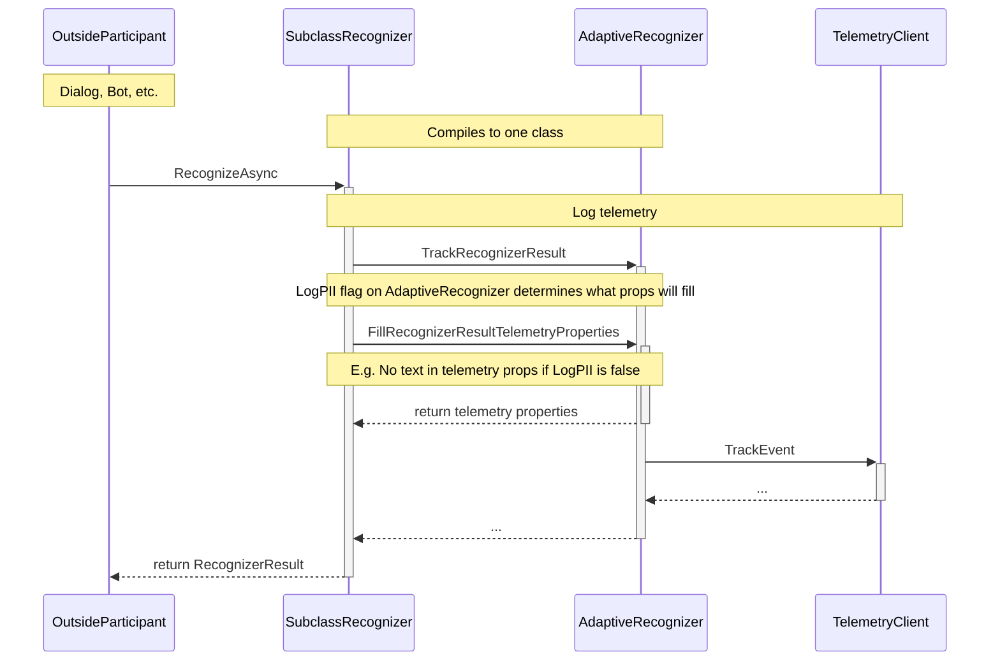

```mermaid
classDiagram
    Recognzier <|-- AdaptiveRecognizer
    AdaptiveRecognizer <|-- LuisAdaptiveRecognizer
    AdaptiveRecognizer <|-- OrchestratorAdaptiveRecognizer
    AdaptiveRecognizer <|-- QnAMakerRecognizer
    AdaptiveRecognizer <|-- MockLuisRecognizer
    AdaptiveRecognizer <|-- CrossTrainedRecognizerSet
    AdaptiveRecognizer <|-- ChannelMentionEntityRecognizer
    AdaptiveRecognizer <|-- EntityRecognizer
    AdaptiveRecognizer <|-- MultiLanguageRecognizer
    AdaptiveRecognizer <|-- RecognizerSet
    AdaptiveRecognizer <|-- RegexRecognizer
    AdaptiveRecognizer <|-- ValueRecognizer

    class AdaptiveRecognizer {
        + BoolExpression LogPersonalInformation
        
        #FillRecognizerTelemetryProperties(RecognizerResult, telemetryProperties, DialogContext)
    }
```

RecognizeAsync -- using recognizer's logpii flag --> FillRecognizerTelemetryProperties -- returns telemetry properties 

```mermaid
sequenceDiagram
    Note over OutsideParticipant: Dialog, Bot, etc.
    participant OutsideParticipant
    Note over SubclassRecognizer, AdaptiveRecognizer: Compiles to one class
    participant SubclassRecognizer
    participant AdaptiveRecognizer
    participant TelemetryClient

    OutsideParticipant ->>+ SubclassRecognizer: RecognizeAsync
        Note over SubclassRecognizer, TelemetryClient: Log telemetry
        SubclassRecognizer ->>+ AdaptiveRecognizer: TrackRecognizerResult

            Note over AdaptiveRecognizer, SubclassRecognizer: LogPII flag on AdaptiveRecognizer determines what props will fill
            SubclassRecognizer ->>+ AdaptiveRecognizer: FillRecognizerResultTelemetryProperties

            Note over AdaptiveRecognizer, SubclassRecognizer: E.g. No text in telemetry props if LogPII is false
            AdaptiveRecognizer -->>- SubclassRecognizer: return telemetry properties

            AdaptiveRecognizer ->>+ TelemetryClient: TrackEvent
            TelemetryClient -->>- AdaptiveRecognizer: ...
        AdaptiveRecognizer -->>- SubclassRecognizer: ...
    SubclassRecognizer -->>- OutsideParticipant: return RecognizerResult
```