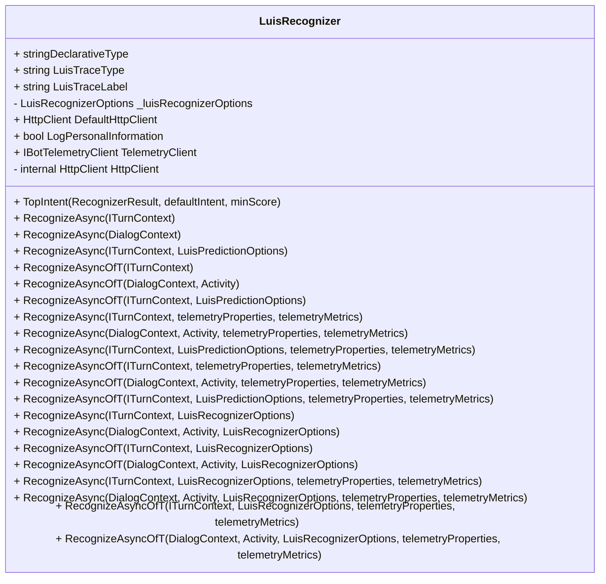

- `LuisRecognizer`
    - Has 4 ctor overloads that are `Obsoilete` -- `"please use LuisRecognizer(LuisRecognizerOptions recognizer)"`:
        - `LuisRecognizer(LuisApplication, LuisPredictionOptions, includeApiResults, HttpClientHandler)`
        - `LuisRecognizer(LuisApplication, IBotTelemetryClient, logPersonalInformation, LuisPredictionOptions, includeApiResults, HttpClientHandler)`
        - `LuisRecognizer(LuisService, LuisPRedictionOptions, includeApiResults, HttpClientHandler)`
    - ctor we should use: `LuisRecognizer(LuisRecognizerOptions, HttpClientHandler)`
    - `RecognizeAsync`:
        - Obsolete:
            - `RecognizeAsync(ITurnContext, LuisPredictionOptions)`
            - `RecognizeAsync<T>(ITurnContext, LuisPredictionOptions)`
            - `RecognizeAsync(ITurnContext, LuisPredictionOptions, telemetryProperties, telemetryMetrics)`
            - `RecognizeAsync<T>(ITurnContext, LuisPredictionOptions, telemetryProperties, telemetryMetrics)`
        - First 3 `RecognizeAsync` return `Task<RecognizerResult>`
        - Second 3 `RecognizeAsync<T>` return `Task<T>`