# `IRecognizer`

### `IRecognizer` Class Diagram
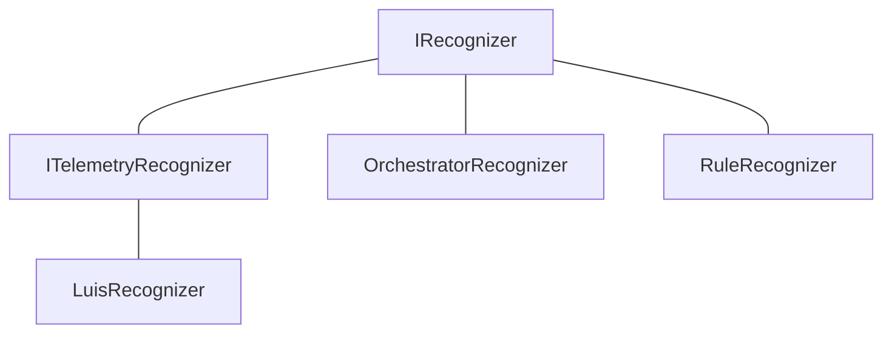
- `RuleRecognizer` test class has 0 references...
    - Test Class in .Dialgos.Declarative.Tests

### Detailed `IRecognizer` Class Diagram
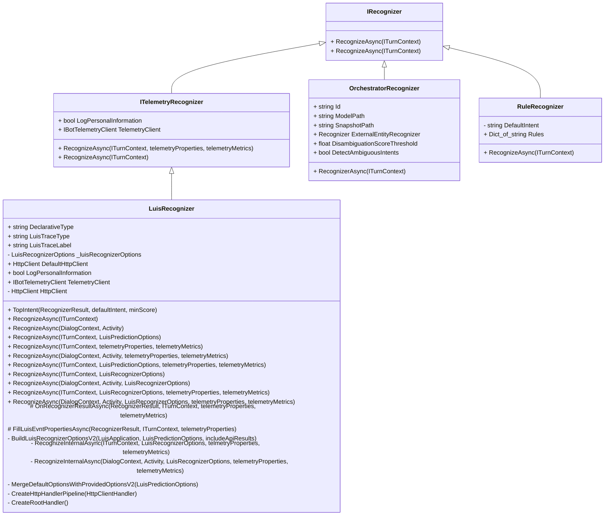

- NOTE: `IRecognizer` has 2 `RecognizeAsync` with different returns:
    - **`Task<RecognizerResult>`** or **`Task<T>`**.
    - I just can't put it in the diagram, since mermaid diagramming tool doesn't allow for method return values =(
- All async methods also have cancellation token, but I excluded to better highlight the differences in each member

- `ITelemetryRecognizer`
    - `RecognizerAsync(ITurnContext, telemetryProperties, telemetryMetrics)` returns:
        1. `Task<RecognizerResult>`
        2. `Task<T> where T : IRecognizerConvert, new()`
        - Note: has generic counterpart `RecognizeAsync<T>`
    - `RecognizeAsync(ITurnContext)` returns `Task<T> where T: IRecognizerConvert, new()`

- `LuisRecognizer`
    - Has 4 ctor overloads that are `Obsolete` -- `"please use LuisRecognizer(LuisRecognizerOptions recognizer)"`:
        - `LuisRecognizer(LuisApplication, LuisPredictionOptions, includeApiResults, HttpClientHandler)`
        - `LuisRecognizer(LuisApplication, IBotTelemetryClient, logPersonalInformation, LuisPredictionOptions, includeApiResults, HttpClientHandler)`
        - `LuisRecognizer(LuisService, LuisPRedictionOptions, includeApiResults, HttpClientHandler)`
    - ctor we should use: `LuisRecognizer(LuisRecognizerOptions, HttpClientHandler)`
    - `RecognizeAsync`:
        - The overloads can be categorized into 4 groups, mix-n-matching 2 themes:
            1. With/Without Telemetry
            2. With `LuisRecognizerOptions` vs. with obsolete `LuisPredictionOptions`
        - 

            
 Obsolete -- any of the RecognizerAsync methods that use LuisPredictionOptions instead of newer LuisRecognizerOptions: 

            
                RecognizeAsync(ITurnContext, LuisPredictionOption)
                RecognizeAsync<T>(ITurnContext, LuisPredictionOption)
                RecognizeAsync(ITurnContext, LuisPredictionOptions, telemetryProperties, telemetryMetric)
                RecognizeAsync<T>(ITurnContext, LuisPredictionOptions, telemetryProperties, telemetryMetric)
        

        - All `RecognizeAsync` methods have a generic counterpart as well. For example:
            - `RecognizeAsync(ITurnContext)`
            - `RecognizeAsync<T>(ITurnContext)`
        - They return either `Task<RecognizerResult>` or `Task<T>`, as stated earlier in `IRecognizerNotes`
- `OrchestratorRecognizer`
    - `Task<RecognizerResult> RecognizeAsync` has generic counterpart of `Task<T> RecognizeAsync<T>`
    
    
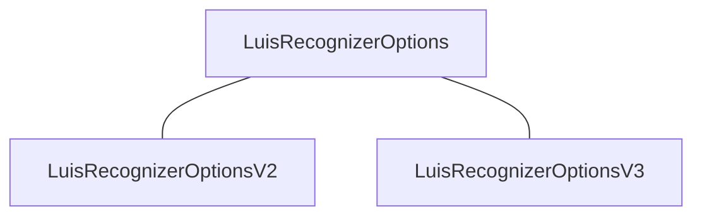
- V2 and V3 differ in that they build URLs differently
    - I suspect LUIS APIs have a V2 and V3 versions that take different shape

### Recognizer Results

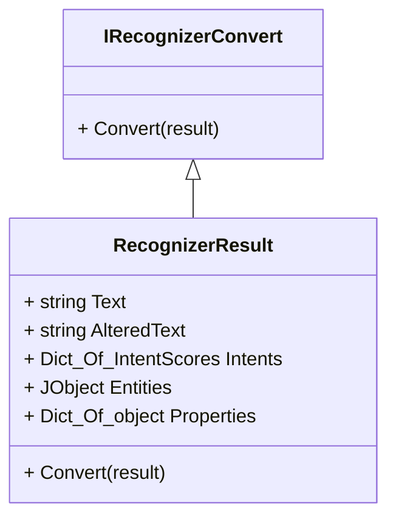

___

# Classes That Derive from `Recognizer`

## `Recognizer` Class Diagram
```mermaid
graph TD
    Recognizer --- LuisAdaptiveRecognizer
    Recognizer --- OrchestratorAdaptiveRecognizer
    Recognizer --- QnAMakerRecognizer
    Recognizer --- MockLuisRecognizer
    Recognizer --- CrossTrainedRecognizerSet
    Recognizer --- ChannelMentionEntityRecognizer
    Recognizer --- EntityRecognizer
    EntityRecognizer -. List of EntityRecognizer .- EntityRecognizerSet
    EntityRecognizer --- TextEntityRecognizer
    TextEntityRecognizer --- AgeEntityRecognizer
    TextEntityRecognizer --- ConfirmationEntityRecognizer
    TextEntityRecognizer --- CurrencyEntityRecognizer
    TextEntityRecognizer --- DateTimeEntityRecognizer
    TextEntityRecognizer --- DimensionEntityRecognizer
    TextEntityRecognizer --- EmailEntityRecognizer
    TextEntityRecognizer --- GuidEntityRecognizer
    TextEntityRecognizer --- HashtagEntityRecognizer
    TextEntityRecognizer --- IpEntityRecognizer
    TextEntityRecognizer --- MentionEntityRecognizer
    TextEntityRecognizer --- NumberRangeEntityRecognizer
    TextEntityRecognizer --- OrdinalEntityRecognizer
    TextEntityRecognizer --- PercentageEntityRecognizer
    TextEntityRecognizer --- PhoneNumberEntityRecognizer
    TextEntityRecognizer --- TemperatureEntityRecognizer
    TextEntityRecognizer --- UrlEntityRecognizer
    Recognizer --- MultiLanguageRecognizer
    Recognizer --- RecognizerSet
    Recognizer --- RegexRecognizer
    Recognizer --- ValueRecognizer
```
- Test classes: `MockLuisRecognizer`, 
- TextEntityRecognizer subclasses seem to justhave Recognize methods that call Microsoft.Recognizers.Text API

## All-In-One, Detailed `Recognizer` Class Diagram
```mermaid
classDiagram
    Recognizer <|-- LuisAdaptiveRecognizer
    Recognizer <|-- OrchestratorAdaptiveRecognizer
    Recognizer <|-- QnAMakerRecognizer
    Recognizer <|-- MockLuisRecognizer
    Recognizer <|-- CrossTrainedRecognizerSet
    Recognizer <|-- ChannelMentionEntityRecognizer
    Recognizer <|-- EntityRecognizer
    Recognizer <|-- MultiLanguageRecognizer
    Recognizer <|-- RecognizerSet
    Recognizer <|-- RegexRecognizer
    Recognizer <|-- ValueRecognizer

    class Recognizer {
        + string ChooseIntent
        + string NoneIntent
        + string Id
        + IBotTelemetryClient TelemetryClient
        + RecognizeAsync(DialogContext, Activity, CancellationToken, telemetryProperties, telemetryMetrics)
        + RecognizeAsync(DialogContext, Activity, CancellationToken, telemetryProperties, telemetryMetrics)
        # CreateChooseIntentResult(recognizerResults)
        # FillRecognizerResultTelemetryProperties(RecognizerResult, telemetryProperties, DialogContext)
        # TrackRecognizerResult(DialogContext, eventName, telemetryProperties, telemetryMetrics)
    }

    class LuisAdaptiveRecognizer {
        + string Kind
        + StringExpression ApplicationId
        + StringExpression Version
        + StringExpression Endpoint
        + StringExpression EndpointKey
        + Recognizer ExternalEntityRecognizer
        + ArrayExpression_Of_Luis_DynamicList DynamicList
        + HttpClientHandler HttpClient
        + BoolExpression LogPersonalInformation

        + RecognizeAsync(DialogContext, Activity, CancellationToken, telemetryProperties, telemetryMetrics)
        + RecognizerOptions(DialogContext)
        # FillRecognizerTelemetryProperties(RecognizerResult, telemetryProperties, DialogContext)
    }

    class OrchestratorAdaptiveRecognizer {
        + string Kind
        + string ResultProperty
        - float UnknownIntentFilterScore
        - Orchestrator orchestrator
        - string _modelPath
        - string _snapshotPath
        - ILabelResolver _resolver

        + StringExpression ModelPath
        + StringExpression SnapshotPath
        + Recognizer ExternalEntityRecognizer
        + NumberExpression DisambiguationScoreThreshold
        + BoolExpression DetectAmbiguousIntents
        + RecognizeAsync(DialogContext)
        - InitializeModel()
    }

    class QnAMakerRecognizer {
        + string Kind
        + string QnAMatchIntent
        + string IntentPrefix

        + StringExpression KnowledgeBaseId
        + StringExpression HostName
        + StringExpression EndpointKey
        + IntExpression Top
        + NumberExpression Threshold
        + bool IsTest
        + StringeExpression RankerType
        + JoinOperator StrictFiltersJoinOperator
        + BoolExpression IncludeDialogNameInMetedata
        + ArrayExpression_Of_Metadata Metadata
        + ObjectExpression_Of_QnARequestContext Context
        + IntExpression QnAId
        + HttpClient HttpClient
        + BoolExpression LogPersonalInformation

        + RecognizeAsync(DialogContext, Activity, CancellationToken, telemetryProperties, telemetryMetrics)
        # GetQnAMakerClientAsync(DialogContext)
    }

    class CrossTrainedRecognizerSet {
        + string Kind
        + string DeferPrefix
        
        + List_Of_Recognizer Recognizers
        
        + RecognizeAsync(DialogContext, Activity, CancellationToken, telemetryProperties, telemetryMetrics)
        + ProcessResults(IEnumberable_Of_RecognizerResults)
        - IsRedirect(intent)
        - GetRedirectId(intent)
        - EnsureRecognizerIds()
    }

    class ChannelMentionEntityRecognizer {
        + string Kind
        + RecognizeAsync(DialogContext, Activity, CancellationToken, telemetryProperties, telemetryMetrics)     
    }

    class EntityRecognizer {
        + RecognizeAsync(DialogContext, Activity, CancellationToken, telemetryProperties, telemetryMetrics)
        + RecognizeEntitiesAsync(DialogContext, entites)
        + RecognizeEntitiesAsync(DialogContext, Activity, entities)
        + RecognizeEntitiesAsync(DialogContext, text, local, entities)
    }

    class MultiLanguageRecognizer {
        + string Kind

        + LanguagePolicy LanguagePolicy
        + Dict_Of_Recognizer Recognizers
        + RecognizeAsync(DialogContext, Activity, CancellationToken, telemetryProperties, telemetryMetrics)
    }

    class RecognizerSet {
        + string Kind

        + List_Of_Recognizer Recognizers

        + RecognizeAsync(DialogContext, Activity, CancellationToken, telemetryProperties, telemetryMetrics)
        - MergeResults(Array_Of_RecognizerResult)
    }

    class RecognizerSet {
        + string Kind

        + List_Of_Recognizer Recognizers

        + RecognizeAsync(DialogContext, Activity, CancellationToken, telemetryProperties, telemetryMetrics)
        - MergeResults(Array_Of_RecognizerResult)
    }

    class RegexRecognizer {
        + string Kind

        + List_Of_IntentPattern Intents
        + List_Of_EntityRecognizer Entities
        
        + RecognizerAsync(DialogContext, Activity, CancellationToken, telemetryProperties, telemetryMetrics)
    }

    class ValueRecognizer {
        + RecognizeAsync(DialogContext, Activity, CancellationToken, telemetryProperties, telemetryMetrics)
    }
```

## Individual Classes

### `Recognizer`

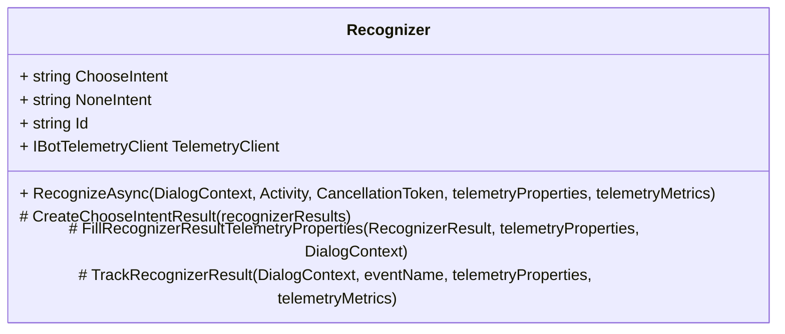
- All methods in `Recognizer` are `virtual`, except for `TrackRecognizerResult`
- `RecognizeAsync`:
    - Has generic counterpart `RecognizerAsync<T>(...)`
    - returns:
        1. `Task<RecognizerResult>`
        2. `Task<T>`

### `LuisAdaptiveRecognizer`
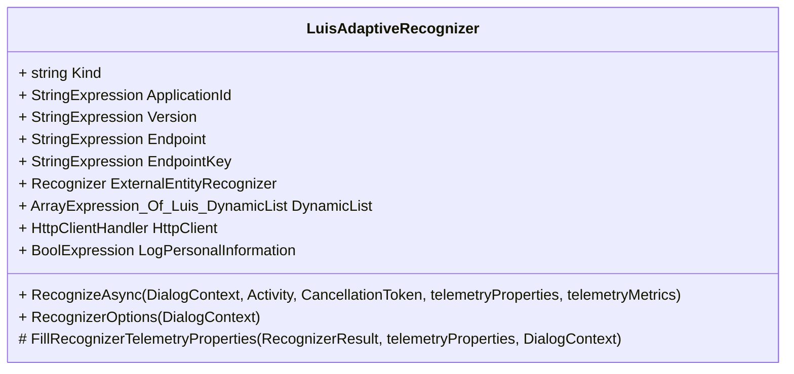

### `OrchestratorAdaptiveRecognizer`
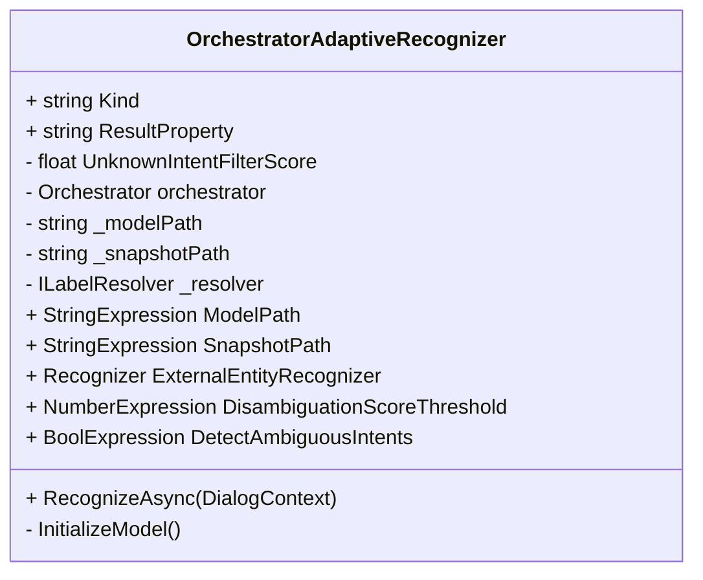

### `QnAMakerRecognizer`
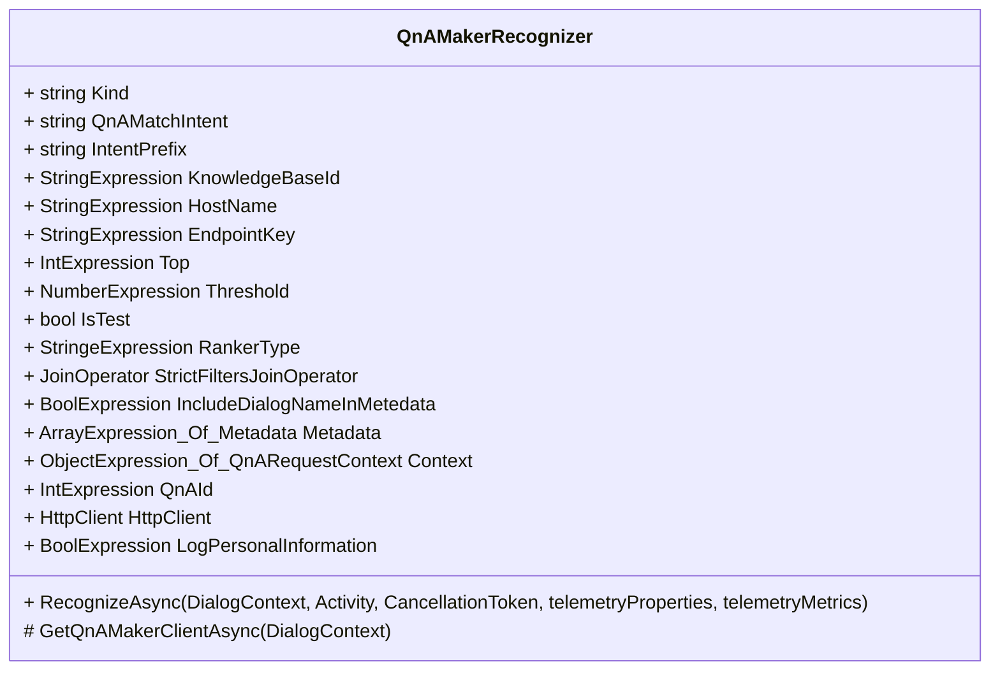

### `CrossTrainedRecognizerSet`
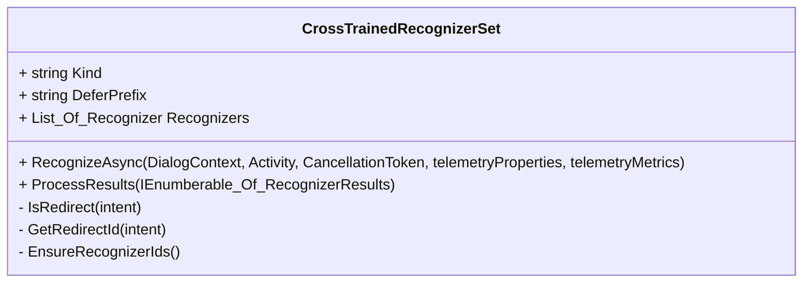

### `ChannelMentionEntityRecognizer`
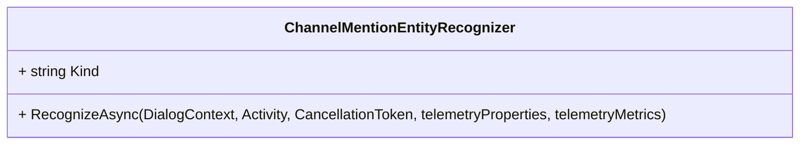

### `EntityRecognizer`
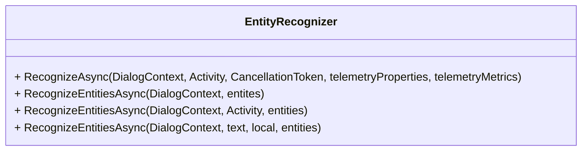
### `MultiLanguageRecognizer`
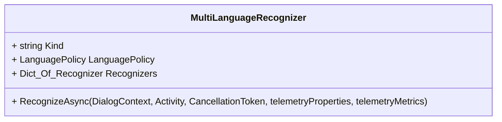

### `RecognizerSet` 
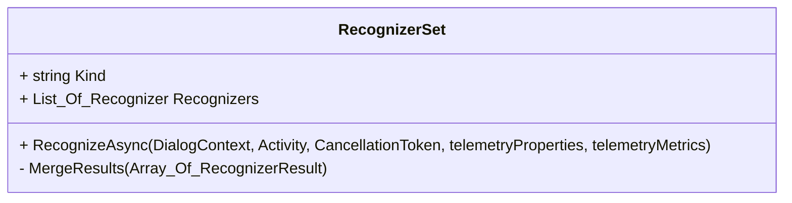
### `RegexRecognizer`
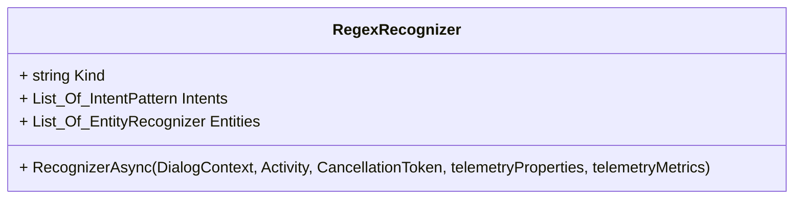

### `ValueRecognizer`
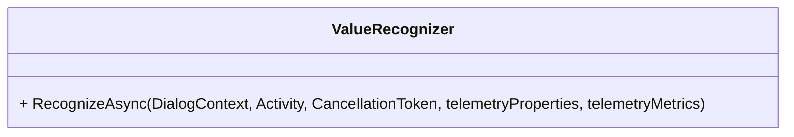