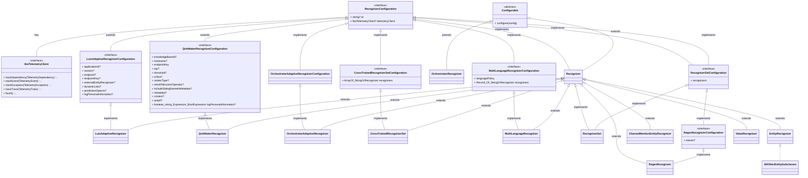

```mermaid
classDiagram

RecognizerConfiguration o-- BotTelemetryClient : has
RecognizerConfiguration <|-- Recognizer : implements
Configurable <|-- Recognizer : extends

RecognizerConfiguration <|-- LuisAdaptiveRecognizerConfiguration : extends
LuisAdaptiveRecognizerConfiguration <|-- LuisAdaptiveRecognizer : implements
Recognizer <|-- LuisAdaptiveRecognizer : extends

RecognizerConfiguration <|-- QnAMakerRecognizerConfiguration : extends
QnAMakerRecognizerConfiguration <|-- QnAMakerRecognizer : implements
Recognizer <|-- QnAMakerRecognizer : extends

OrchestratorAdaptiveRecognizerConfiguration <|-- OrchestratorAdaptiveRecognizer : implements
RecognizerConfiguration <|-- OrchestratorAdaptiveRecognizerConfiguration : implements
Recognizer <|-- OrchestratorAdaptiveRecognizer : extends

Configurable <|-- OrchestratorRecognizer : extends

RecognizerConfiguration <|-- CrossTrainedRecognizerSetConfiguration : implements
CrossTrainedRecognizerSetConfiguration <|-- CrossTrainedRecognizerSet : implements
Recognizer <|-- CrossTrainedRecognizerSet : extends

RecognizerConfiguration <|-- MultiLanguageRecognizerConfiguration : implements
MultiLanguageRecognizerConfiguration <|-- MultiLanguageRecognizer : implements
Recognizer <|-- MultiLanguageRecognizer : extends

Recognizer <|-- RecognizerSet : implements
RecognizerSetConfiguration <|-- RecognizerSet : implements
RecognizerConfiguration <|-- RecognizerSetConfiguration : implements
RecognizerConfiguration <|-- RecognizerSetConfiguration : implements

Recognizer <|-- RegexRecognizer : extends
RegexRecognizerConfiguration <|-- RegexRecognizer : implements
RecognizerSetConfiguration <|-- RegexRecognizerConfiguration : implements

Recognizer <|-- ChannelMentionEntityRecognizer : extends
Recognizer <|-- EntityRecognizer : extends
Recognizer <|-- ValueRecognizer : extends

EntityRecognizer <|.. AllOtherEntitySubclasses

class Configurable {
    <<abstract>>
    + configure(config)
}
class RecognizerConfiguration {
    <<interface>>
    + string? id
    + BotTelemetryClient? telemetryClient
}

class BotTelemetryClient {
    <<interface>>
    + trackDependency(TelemetryDependency);
    + trackEvent(TelemetryEvent);
    + trackException(TelemetryException);
    + trackTrace(TelemetryTrace);
    + flush();
}

class LuisAdaptiveRecognizerConfiguration {
    <<interface>>
    + applicationId?
    + version?
    + endpoint?
    + endpointKey?
    + externalEntityRecognizer?
    + dynamicLists?
    + predictionOptions?
    + logPersonalInformation?
}

class QnAMakerRecognizerConfiguration {
    <<interface>>
    + knowledgeBaseId?
    + hostname?
    + endpointKey
    + top?
    + threshold?
    + isTest?
    + rankerType?
    + strictFiltersJoinOperator?
    + includeDialogNameInMetadata?
    + metadata?
    + context?
    + qnaId?
    + boolean_string_Expression_BoolExpression logPersonalInformation?
}

class CrossTrainedRecognizerSetConfiguration {
    <<interface>>
    + ArrayOf_StringOrRecognizer recognizers
}

class MultiLanguageRecognizerConfiguration {
    <<interface>>
    + languagePolicy
    + Record_Of_StringOrRecognizer recognizers
}

class RegexRecognizerConfiguration {
    <<interface>>
    + intents?
}

class RecognizerSetConfiguration {
    <<interface>>
    + recognizers
}
```