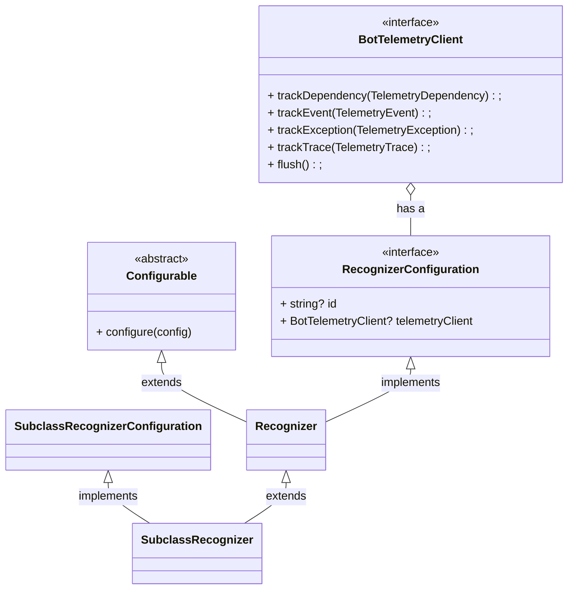
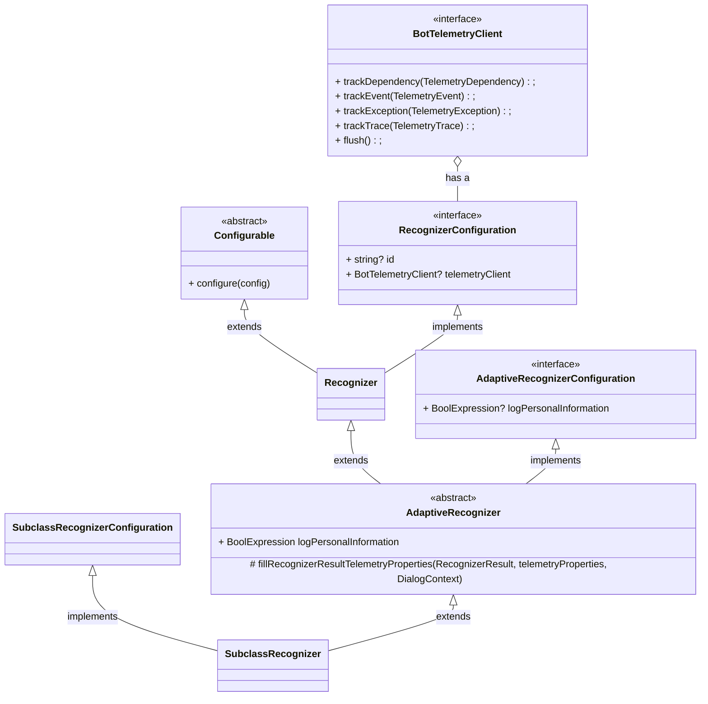

## Currently

```mermaid
classDiagram
BotTelemetryClient o-- RecognizerConfiguration : has a
SubclassRecognizerConfiguration <|-- SubclassRecognizer : implements
Configurable <|-- Recognizer : extends
RecognizerConfiguration <|-- Recognizer : implements
Recognizer <|-- SubclassRecognizer : extends

class Configurable {
    <<abstract>>
    + configure(config)
}

class RecognizerConfiguration {
    <<interface>>
    + string? id
    + BotTelemetryClient? telemetryClient
}

class BotTelemetryClient {
    <<interface>>
    + trackDependency(TelemetryDependency);
    + trackEvent(TelemetryEvent);
    + trackException(TelemetryException);
    + trackTrace(TelemetryTrace);
    + flush();
}
```

## Changed

```mermaid
classDiagram
BotTelemetryClient o-- RecognizerConfiguration : has a

SubclassRecognizerConfiguration <|-- SubclassRecognizer : implements
Configurable <|-- Recognizer : extends

RecognizerConfiguration <|-- Recognizer : implements
Recognizer <|-- AdaptiveRecognizer : extends

AdaptiveRecognizerConfiguration <|-- AdaptiveRecognizer : implements
AdaptiveRecognizer <|-- SubclassRecognizer : extends

class BotTelemetryClient {
    <<interface>>
    + trackDependency(TelemetryDependency);
    + trackEvent(TelemetryEvent);
    + trackException(TelemetryException);
    + trackTrace(TelemetryTrace);
    + flush();
}

class RecognizerConfiguration {
    <<interface>>
    + string? id
    + BotTelemetryClient? telemetryClient
}

class Configurable {
    <<abstract>>
    + configure(config)
}

class AdaptiveRecognizerConfiguration {
    <<interface>>
    + BoolExpression? logPersonalInformation
}

class AdaptiveRecognizer {
    <<abstract>>
    + BoolExpression logPersonalInformation
    # fillRecognizerResultTelemetryProperties(RecognizerResult, telemetryProperties, DialogContext)
}
```
