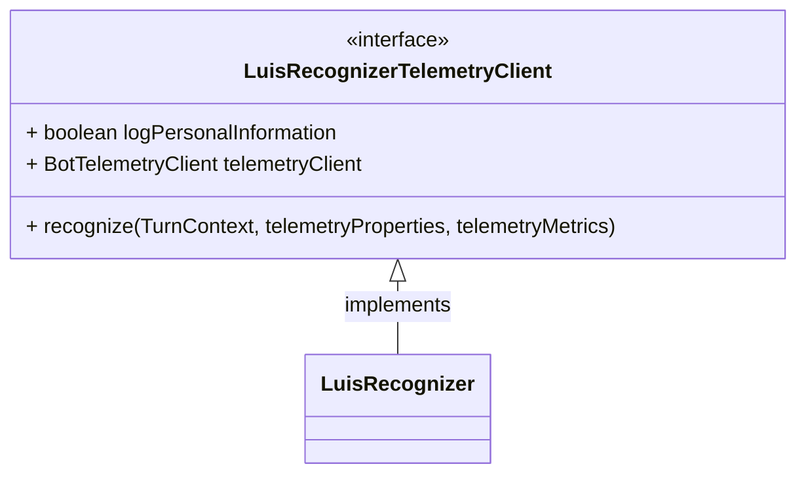

```mermaid
classDiagram
LuisRecognizerTelemetryClient <|-- LuisRecognizer : implements

class LuisRecognizerTelemetryClient {
    <<interface>>
    + boolean logPersonalInformation
    + BotTelemetryClient telemetryClient

    + recognize(TurnContext, telemetryProperties, telemetryMetrics)
}
```