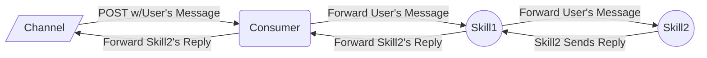
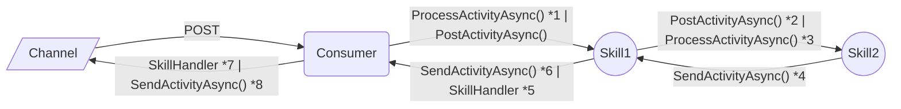
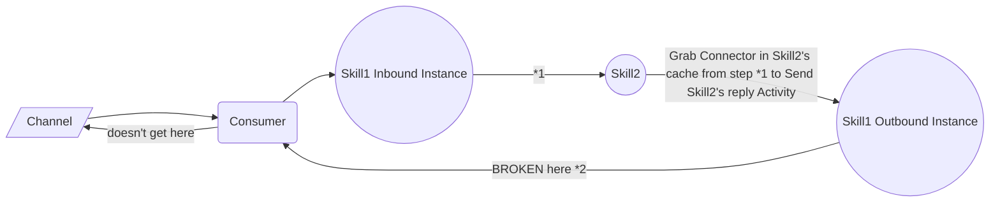

# Overview of Chaining Skills Flow (2 EchoSkillBots)

Issue: In BF we create Connectors to send replies. The current Skills model makes the creation of the Connector on inbound Activity processing, caching that Connector, then on outbound we grab what's cached. Since caches are local to the instance, this muodel, will break in the following scenarios:
- If any of the bots that are in the chain have multiple instances (for example, inbound Activity-processing instance of Skill1 and an outbound Activity-processing instance of Skill1)
- If any of the bots that's a parent reboots, it loses its cache of Connector Clients

    
 Click to view full details of single-instance scenario of chaining Skills 

1. Creates ConnectorClient with `AppCredentials` and `BaseUri` for ***Skill1-to-Consumer*** replies
    - Credentials:
        - MicrosoftAppId: Skill1's AppId
        - OAuthScope: Consumer's AppId
    - BaseUri:
        - Used in Connectors to build the `serviceUrl` to send replies
        - The URI is to the Consumer's endpoint that handles skills

2. Creates `AppCredentials`, which it uses to get a Token from Skill1 to POST to Skill2 (we're inside Skill1):
    - MicrosoftAppId: Skill1's AppId
    - OAuthScope: Skill2's AppId
    - `POST http://localhost:39782/api/messages` (Skill2's BotController endpoint)

3. Inbound, inside Skill2
    - Creates Connector with `AppCredentials` that correctly allows for ***Skill2-to-Skill1*** replies
        - MicrosoftAPpId: Skill2's AppId
        - OAuthScope: Skill1's AppId
    - Caches Skill2-to-Skill1 Connector

4. Inside Skill2: Grabs the Skill2-to-Skill1 Connector from TurnState, created on the inbound call in *3
    - `POST "http://localhost:39781/api/skills/v3/conversations/{Skill1-and-Skill2-ConvoId}/activities/{activityId}"` (Skill1's Skill Handler endpoint)

5. Skill1's `SkillHandler` eventually calls `ContinueConversationAsync()` so that it could eventually `RunPipelineAsync()` to forward Skill2's message to Consumer
    - Calls `EnsureChannelConnectorClientIsCreatedAsync()` to make `AppCredentials` that are scoped to default `api.botframework.com` (BF Channel Service)
        - Does not use these Channel-scoped Credentials on the Connector it creates, however. 
        - **Instead it grabs the Connector that was cached in step 1**, which is scoped correctly to the Consumer for outbound reply from Skill1
    - Next calls `CreateConnectorClientAsync()`
        - **It grabs the Connector that was cached in step 1**, once again

6. `POST "http://localhost:3978/api/skills/v3/conversations/{Consumer-and-Skill1-ConvoId}/activities/{activityId}"` to forward Skill2's message from Skill1 to Consumer, using Connector from step *5

7. Consumer's `SkillHandler` eventually calls `ContinueConversationAsync()` so that it could eventually `RunPipelineAsync()` to forward Skill2's message to Channel
    - Calls `EnsureChannelConnectorClientIsCreatedAsync()` 
        - Gets cached `AppCredentials` scoped from Consumer-to-Channel (Created on first inbound Channel-to-Consumer ProcessActivityAsync())
        - Grabs cached Connector scoped from Consumer-to-Channel
    - Calls `CreateConnectorClientAsync()`
        - Gets cached `AppCredentials` scoped from Consumer-to-Skill1. It does not use these credentials on the outbound reply right now.
        - Grabs cached Connector that has credentials scoped from Consumer-to-Channel

8. `POST "http://localhost:61007/v3/conversations/{Consumer-and-Channel-ConvoId}/activities/{activityId}"` to finally forward Skill2's reply to the User at the Channel

2. Skill2 sends its reply to  Skill1's `SkillHandler`, which eventually calls `ContinueConversationAsync()`:
    - `EnsureChannelConnectorClientIsCreatedAsync()`
        - Nothing in outbound instance of Skill1's cache
        - Therefore it creates and caches a new Connector that has:
            - BaseUri that points to Consumer
            - BUT Credentials that have default OAuthScope (api.botframework.com, the BF Channel Service layer b/t Consumer and Channel)
            - (we want scope to be Consumer's AppId to go from Skill1 to Consumer)
    - `CreateConnectorClientAsync()`
        - Creates and caches Skill1-to-Skill2 Credentials. We don't use these.
        - Always instead grabs the cached Connector that was just previously created 1 step before in `EnsureChannelConnectorClientIsCreatedAsync()`

    