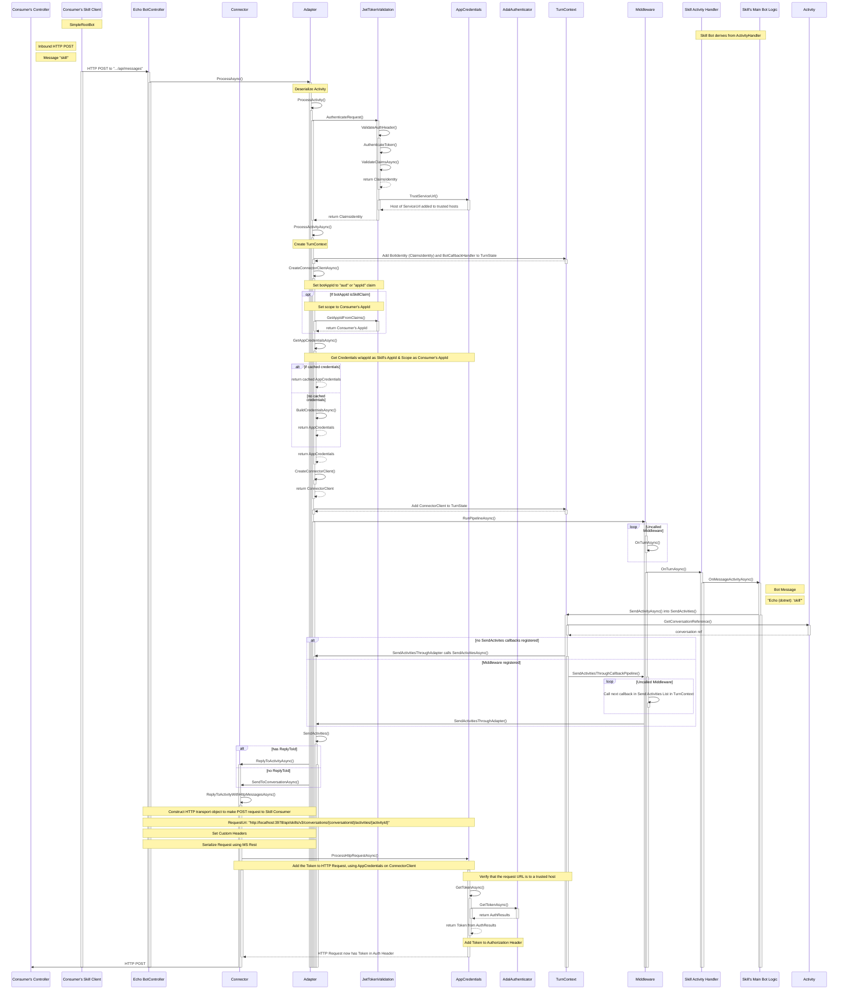

# Inbound to EchoSkillBot

```mermaid
    sequenceDiagram
        participant ConsumerController as Consumer's Controller
        participant SkillClient as Consumer's Skill Client
        Note over SkillClient: SimpleRootBot
        participant EchoBotController as Echo BotController
        participant Connector
        participant Adapter
        participant JwtTokenValidation
        participant AppCredentials
        participant AdalAuthenticator
        participant TurnContext
        participant Middleware
        participant SkillActivityHandler as Skill Activity Handler
        participant SkillMainBotLogic as Skill's Main Bot Logic

        Note over SkillActivityHandler, SkillMainBotLogic: Skill Bot derives from ActivityHandler

        Note left of SkillClient: Inbound HTTP POST
        Note left of SkillClient: Message "skill"
        SkillClient ->> EchoBotController: HTTP POST to ".../api/messages"
        activate SkillClient
        activate EchoBotController
            EchoBotController ->> Adapter: ProcessAsync()
            activate EchoBotController
            activate Adapter
                Note over Adapter: Deserialize Activity
                Adapter ->> Adapter: ProcessActivity()
                activate Adapter
                    Adapter ->> JwtTokenValidation: AuthenticateRequest()
                    activate Adapter
                    activate JwtTokenValidation
                        JwtTokenValidation ->> JwtTokenValidation: ValidateAuthHeader()
                        activate JwtTokenValidation
                            JwtTokenValidation ->> JwtTokenValidation: AuthenticateToken()
                            JwtTokenValidation ->> JwtTokenValidation: ValidateClaimsAsync()
                            JwtTokenValidation -->> JwtTokenValidation: return ClaimsIdentity
                        deactivate JwtTokenValidation

                        JwtTokenValidation ->> AppCredentials: TrustServiceUrl()
                        activate JwtTokenValidation
                        activate AppCredentials
                            AppCredentials -->> JwtTokenValidation: Host of ServiceUrl added to trusted hosts
                        deactivate AppCredentials
                        deactivate JwtTokenValidation

                        JwtTokenValidation -->> Adapter: return Claimsidentity
                    deactivate JwtTokenValidation
                    deactivate Adapter

                    Adapter ->> Adapter: ProcessActivityAsync()
                    activate Adapter
                        Note over Adapter: Create TurnContext

                        Adapter ->> TurnContext: Add BotIdentity (ClaimsIdentity) and BotCallbackHandler to TurnState
                        activate Adapter
                        activate TurnContext
                            TurnContext -->> Adapter: 
                        deactivate TurnContext
                        deactivate Adapter

                        Adapter ->> Adapter: CreateConnectorClientAsync()
                        activate Adapter
                            Note over Adapter, JwtTokenValidation: Set botAppId to "aud" or "appId" claim

                            opt If botAppId isSkillClaim
                                Note over Adapter, JwtTokenValidation: Set scope to Consumer's AppId
                                Adapter ->> JwtTokenValidation: GetAppIdFromClaims()
                                activate Adapter
                                activate JwtTokenValidation
                                    JwtTokenValidation -->> Adapter: return Consumer's AppId
                                deactivate JwtTokenValidation
                                deactivate Adapter
                            end

                            Adapter ->> Adapter: GetAppCredentialsAsync()
                            activate Adapter
                                Note over Adapter, AppCredentials: Get Credentials w/appId as Skill's AppId & Scope as Consumer's AppId

                                alt if cached credentials
                                    Adapter -->> Adapter: return cached AppCredentials
                                    
                                    else no cached credentials
                                        Adapter ->> Adapter: BuildCredentialsAsync()

                                        Adapter -->> Adapter: return AppCredentials
                                end
                                Adapter -->> Adapter: return AppCredentials
                            deactivate Adapter

                            Adapter ->> Adapter: CreateConnectorClient()
                            activate Adapter
                            deactivate Adapter

                            Adapter -->> Adapter: return ConnectorClient
                        deactivate Adapter

                        Adapter ->> TurnContext: Add ConnectorClient to TurnState
                        activate Adapter
                        activate TurnContext
                            TurnContext -->> Adapter: 
                        deactivate TurnContext
                        deactivate Adapter

                        Adapter ->> Middleware: RunPipelineAsync()
                        activate Adapter
                        activate Middleware
                            loop Uncalled Middleware
                            activate Middleware
                                Middleware ->> Middleware: OnTurnAsync()
                            deactivate Middleware
                            end

                            Middleware ->> SkillActivityHandler: OnTurnAsync()
                            activate Middleware
                            activate SkillActivityHandler
                                SkillActivityHandler ->> SkillMainBotLogic: OnMessageActivityAsync()
                                activate SkillActivityHandler
                                activate SkillMainBotLogic
                                    Note right of SkillMainBotLogic: Bot Message
                                    Note right of SkillMainBotLogic: "Echo (dotnet): 'skill'"

                                    SkillMainBotLogic ->> TurnContext: SendActivityAsync() into SendActivities()
                                    activate SkillMainBotLogic
                                    activate TurnContext
                                        TurnContext ->> Activity: GetConversationReference()
                                        activate TurnContext
                                        activate Activity
                                            Activity -->> TurnContext: conversation ref
                                        deactivate Activity
                                        deactivate TurnContext

                                        alt no SendActivites callbacks registered
                                            TurnContext ->> Adapter: SendActivitiesThroughAdapter calls SendActivitiesAsync()
                                            activate TurnContext
                                            activate Adapter

                                            else Middleware registered
                                                TurnContext ->> Middleware: SendActivitiesThroughCallbackPipeline()
                                                activate Middleware

                                                    loop Uncalled Middleware
                                                        Middleware ->> Middleware: Call next callback in Send Activities List in TurnContext
                                                        activate Middleware
                                                        deactivate Middleware
                                                    end

                                                Middleware ->> Adapter: SendActivitiesThroughAdapter()

                                        end

                                            Adapter ->> Adapter: SendActivities()
                                            activate Adapter

                                            
                                            alt has ReplyToId
                                                Adapter ->> Connector: ReplyToActivityAsync() 
                                                activate Adapter
                                                activate Connector
                                            else no ReplyToId
                                                Adapter ->> Connector: SendToConversationAsync()
                                            end
                                                
                                                Connector ->> Connector: ReplyToActivityWithHttpMessagesAsync()
                                                activate Connector
                                                    Note over EchoBotController, Adapter: Construct HTTP transport object to make POST request to Skill Consumer
                                                    Note over EchoBotController, AppCredentials: RequestUri: "http://localhost:3978/api/skills/v3/conversations/{conversationId}/activities/{activityId}"
                                                    Note over EchoBotController, Adapter: Set Custom Headers
                                                    Note over EchoBotController, Adapter: Serialize Request using MS Rest

                                                    Connector ->> AppCredentials: ProcessHttpRequestAsync()
                                                    Note over Connector, AppCredentials: Add the Token to HTTP Request, using AppCredentials on ConnectorClient
                                                    activate Connector
                                                    activate AppCredentials
                                                        Note over AppCredentials, TurnContext: Verify that the request URL is to a trusted host
                                                        
                                                        AppCredentials ->> AppCredentials: GetTokenAsync()
                                                        activate AppCredentials
                                                            AppCredentials ->> AdalAuthenticator: GetTokenAsync()
                                                            activate AppCredentials
                                                            activate AdalAuthenticator
                                                                AdalAuthenticator -->> AppCredentials: return AuthResults
                                                            deactivate AdalAuthenticator
                                                            deactivate AppCredentials

                                                            AppCredentials -->> AppCredentials: return Token from AuthResults
                                                        deactivate AppCredentials

                                                        Note over AppCredentials, AdalAuthenticator: Add Token to Authorization Header
                                                        
                                                        AppCredentials -->> Connector: HTTP Request now has Token in Auth Header
                                                    deactivate Connector
                                                    deactivate AppCredentials

                                                    Connector ->> ConsumerController: HTTP POST
                                                deactivate Connector

                                                deactivate Connector
                                                deactivate Adapter

                                            deactivate Adapter

                                            deactivate Middleware
                                            deactivate Adapter
                                            deactivate TurnContext
                                    deactivate TurnContext
                                    deactivate SkillMainBotLogic
                                deactivate SkillMainBotLogic
                                deactivate SkillActivityHandler
                            deactivate SkillActivityHandler
                            deactivate Middleware
                        deactivate Middleware
                        deactivate Adapter

                    deactivate Adapter
                deactivate Adapter
            deactivate Adapter
            deactivate EchoBotController
        deactivate EchoBotController
        deactivate SkillClient

```