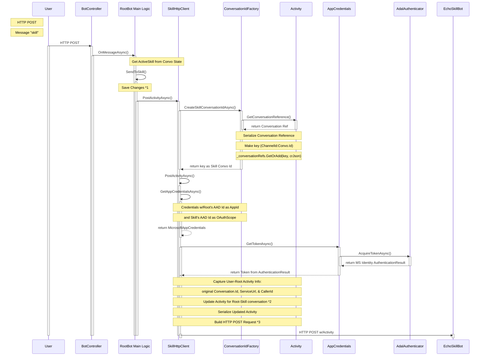

# C# RootBot and EchoSkillBot Flow

- *1 Always SaveChanges() before calling a Skill, so that any Activity generated by the Skill will have access to current, accurate state
- *2 See ActivityConversion diagram
- *3 See BuildRequest diagram