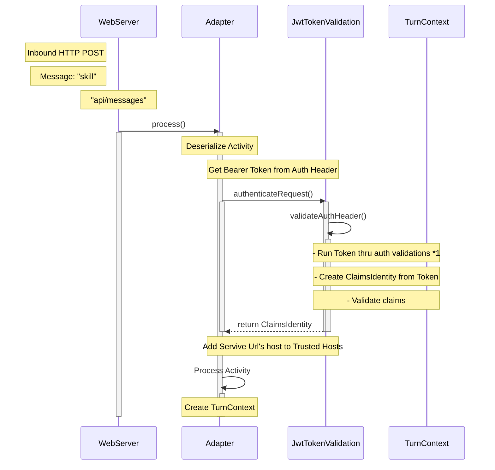

# Inbound from Channel to SimpleRootBot

```mermaid
sequenceDiagram

    participant WebServer
    participant Adapter
    participant JwtTokenValidation
    participant TurnContext

    Note left of WebServer: Inbound HTTP POST 
    Note left of WebServer: Message: "skill"
    Note over WebServer: "api/messages" 
    WebServer ->> Adapter: process()
    activate WebServer
    activate Adapter
        Note over Adapter: Deserialize Activity
        Note over Adapter, JwtTokenValidation: Get Bearer Token from Auth Header

        Adapter ->> JwtTokenValidation: authenticateRequest()
        activate Adapter
        activate JwtTokenValidation
            JwtTokenValidation ->> JwtTokenValidation: validateAuthHeader()
            activate JwtTokenValidation
                Note over JwtTokenValidation, TurnContext: - Run Token thru auth validations *1
                Note over JwtTokenValidation, TurnContext: - Create ClaimsIdentity from Token
                Note over JwtTokenValidation, TurnContext: - Validate claims

                JwtTokenValidation -->> Adapter: return ClaimsIdentity
            deactivate JwtTokenValidation
        deactivate JwtTokenValidation
        deactivate Adapter

        Note over Adapter, JwtTokenValidation: Add Servive Url's host to Trusted Hosts

        Adapter ->> Adapter: Process Activity
        activate Adapter
            Note over Adapter: Create TurnContext
        deactivate Adapter
    deactivate Adapter
    deactivate WebServer
```
- *1 Validation requirements vary depending on Channel from which the Activity was sent