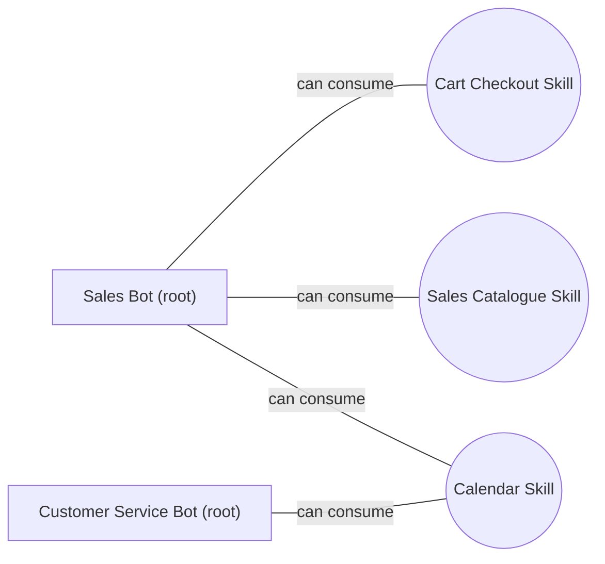

```mermaid

graph LR

SalesBot["Sales Bot (root)"] -- can consume --- CartCheckoutSkill(("Cart Checkout Skill "))
SalesBot -- can consume --- SalesCatalogueSkill((Sales Catalogue Skill))
SalesBot -- can consume --- CalendarSkill((Calendar Skill))

CustomerServiceBot["Customer Service Bot (root)"] -- can consume --- CalendarSkill

```

* A root bot can consume many skills
* A skill can be consumed by many bots