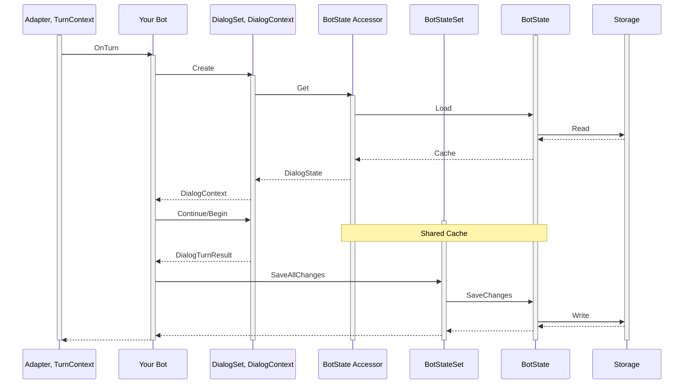

```mermaid
    sequenceDiagram
        participant AT as Adapter, TurnContext
        participant Your Bot
        participant DSetDContext as DialogSet, DialogContext
        participant BotStateAccessor as BotState Accessor
        participant BotStateSet
        participant BotState
        participant Storage


        activate Storage
        activate BotState

        activate AT
        AT->>Your Bot: OnTurn

        activate Your Bot
        Your Bot->>DSetDContext: Create

        activate DSetDContext
        DSetDContext->>BotStateAccessor: Get

        activate BotStateAccessor
        BotStateAccessor->>BotState: Load

        BotState->>Storage: Read

        Storage-->>BotState: 
        BotState-->>BotStateAccessor: Cache
        BotStateAccessor-->> DSetDContext:DialogState
        DSetDContext-->>Your Bot: DialogContext

        Your Bot->>DSetDContext: Continue/Begin

        activate BotStateSet
        Note over BotStateAccessor, BotState: Shared Cache

        DSetDContext-->>Your Bot: DialogTurnResult

        Your Bot->>BotStateSet: SaveAllChanges
        BotStateSet->>BotState: SaveChanges
        BotState->>Storage: Write

        Storage-->>BotState: 
        BotState-->>BotStateSet: 
        BotStateSet-->>Your Bot: 
        Your Bot-->>AT: 
        
        deactivate BotStateAccessor
        deactivate DSetDContext
        deactivate Your Bot
        deactivate BotStateSet
        deactivate AT
        deactivate BotState
        deactivate Storage

```

